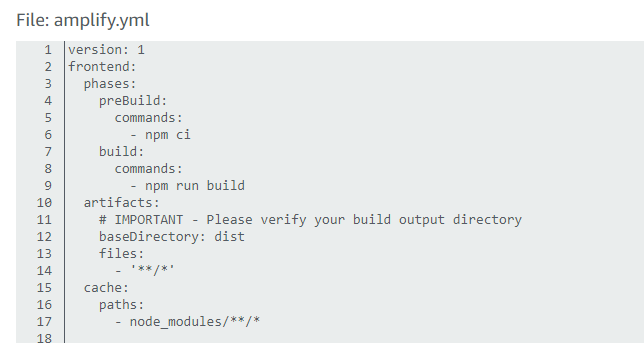
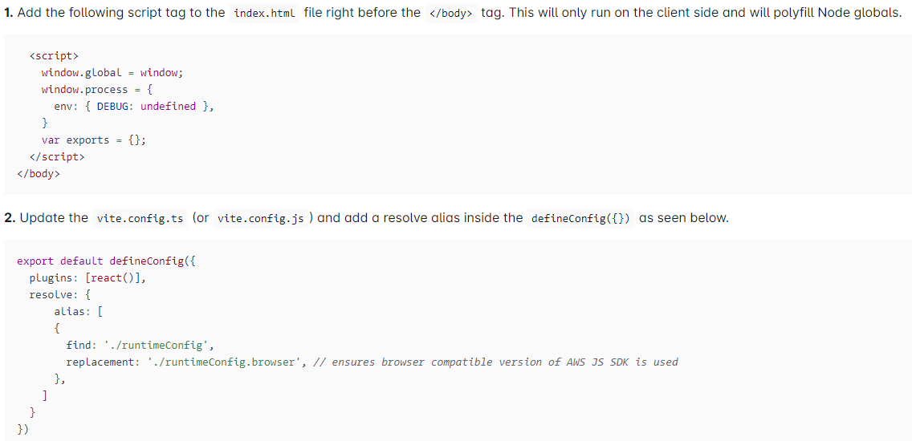

# React + TypeScript + Vite

This template provides a minimal setup to get React working in Vite with HMR and some ESLint rules.

Currently, two official plugins are available:

- [@vitejs/plugin-react](https://github.com/vitejs/vite-plugin-react/blob/main/packages/plugin-react/README.md) uses [Babel](https://babeljs.io/) for Fast Refresh
- [@vitejs/plugin-react-swc](https://github.com/vitejs/vite-plugin-react-swc) uses [SWC](https://swc.rs/) for Fast Refresh

## Expanding the ESLint configuration

If you are developing a production application, we recommend updating the configuration to enable type aware lint rules:

- Configure the top-level `parserOptions` property like this:

```js
   parserOptions: {
    ecmaVersion: 'latest',
    sourceType: 'module',
    project: ['./tsconfig.json', './tsconfig.node.json'],
    tsconfigRootDir: __dirname,
   },
```

- Replace `plugin:@typescript-eslint/recommended` to `plugin:@typescript-eslint/recommended-type-checked` or `plugin:@typescript-eslint/strict-type-checked`
- Optionally add `plugin:@typescript-eslint/stylistic-type-checked`
- Install [eslint-plugin-react](https://github.com/jsx-eslint/eslint-plugin-react) and add `plugin:react/recommended` & `plugin:react/jsx-runtime` to the `extends` list

# AWS Amplify Errors I encountered and how I fixed them

In the Amplify.yaml file, add "dist" as value to the baseDirectory key as shown below

This is because vite uses "dist" as its default output folder

Using vite with AWS Amplify, you must follow these modifications as shown here https://ui.docs.amplify.aws/react/getting-started/usage/vite


## Helpful Links

https://ui.docs.amplify.aws/react/getting-started/usage/vite

https://aws.amazon.com/getting-started/hands-on/build-react-app-amplify-graphql/module-three/?e=gs2020&p=build-a-react-app-two

https://docs.amplify.aws/guides/hosting/vite/q/platform/js/

https://ui.docs.amplify.aws/react/connected-components/authenticator
